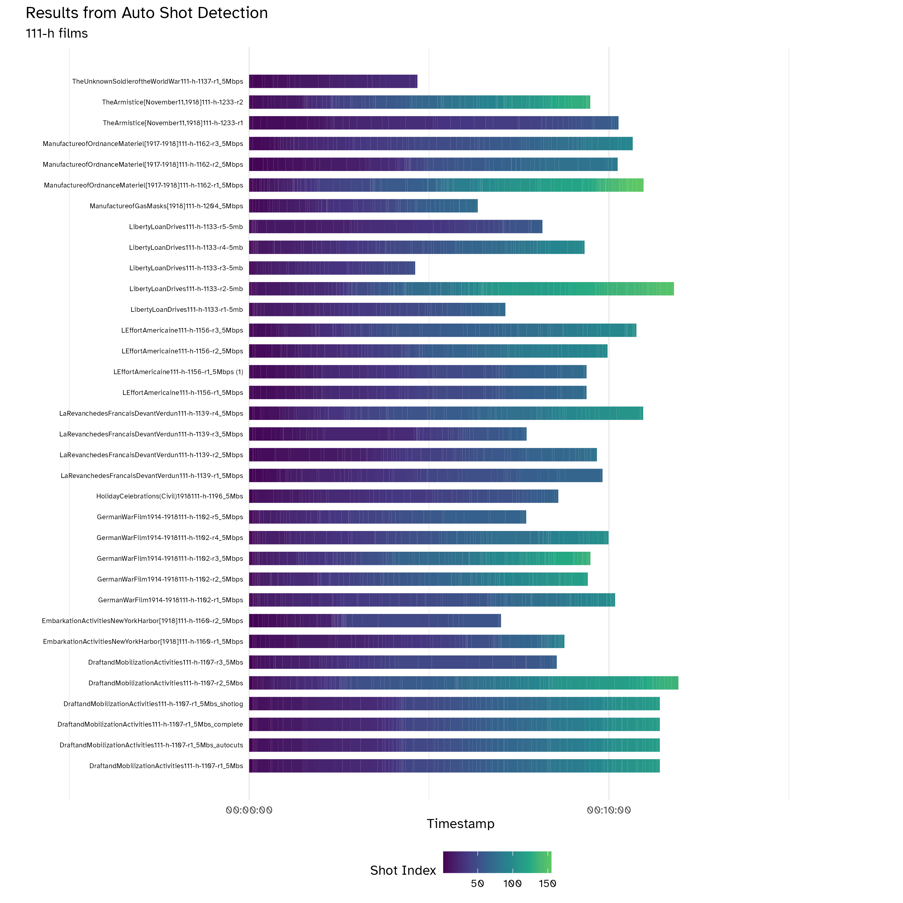

# cut-detection-MEP

-   `process-json-to-csv.R`: Parse JSON files from cut detection software to simple CSV's (one per file)

-   `plot-shot-results.R` : Uses CSV files to plot the start and end times for each shot for each film:

